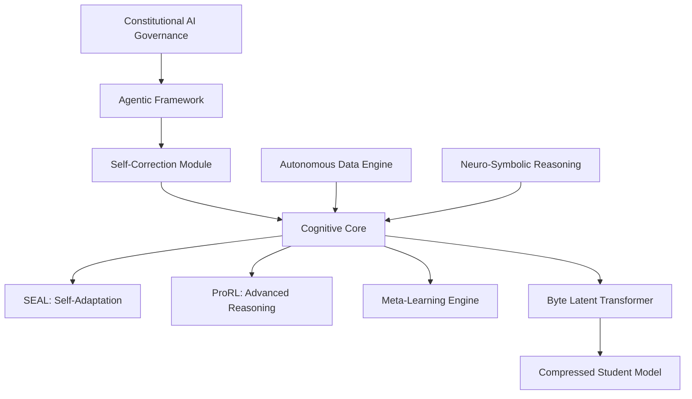

# Jigyasa: A Self-Improving, Agentic Language Model

<div align="center">

[](https://www.python.org/downloads/)
[](https://pytorch.org/)
[](https://opensource.org/licenses/MIT)
[](https://github.com/jigyasa-ai/jigyasa)

**🧠 Curiosity-driven • 🚀 Self-improving • 🌐 Autonomous • 💻 On-device**

*Jigyasa (Sanskrit: जिज्ञासा) - "thirst for knowledge"*

</div>

## 🌟 What is Jigyasa?

Jigyasa represents a paradigm shift in language model design - from static, monolithic models to dynamic, self-improving systems. Built from the ground up with cutting-edge research, Jigyasa integrates:

- **🔤 Byte Latent Transformer (B.L.T.)**: Tokenizer-free architecture for universal data processing
- **🧠 Self-Adapting Language Models (SEAL)**: Continuous learning through self-generated data
- **🎯 Prolonged Reinforcement Learning (ProRL)**: Advanced reasoning via extended RL training
- **🌐 Autonomous Data Engine**: Web-scale data acquisition without human intervention
- **🤔 Self-Correction**: "Think before answering" with verification mechanisms
- **⚖️ Constitutional AI**: Embedded ethical governance for safe operation
- **💻 On-Device Optimization**: Compressed models that run on laptops

## 🚀 Quick Start

### Installation

```bash
pip install jigyasa
```

### Interactive Demo

```bash
# Quick demonstration
python scripts/quick_start.py

# Full interactive mode
jigyasa interactive
```

### Simple Usage

```python
from jigyasa import JigyasaSystem

# Initialize the system
system = JigyasaSystem()
system.initialize()

# Experience self-correction in action
result = system.self_correction.think_before_answer(
    query="What are the implications of quantum computing for cryptography?",
    query_type="analytical"
)

# See the thinking process
print("🤔 Thinking Process:")
print(result['thinking_process'])

print("\n✅ Final Answer:")
print(result['final_response'])

print(f"\n📊 Confidence: {result['confidence_score']:.2f}")
```

## 🏗️ Architecture Overview



### 🔬 Core Innovations

#### Byte Latent Transformer (B.L.T.)
- **No tokenization**: Processes raw bytes for universal compatibility
- **Dynamic patching**: Entropy-based segmentation for efficient computation
- **Pan-lingual**: Handles any language, code, or data format seamlessly

#### Self-Adapting Language Models (SEAL)
- **Autonomous learning**: Generates its own training data
- **Continuous adaptation**: Updates weights based on new information
- **Meta-learning**: Learns how to learn more effectively

#### Prolonged Reinforcement Learning (ProRL)
- **Extended training**: Thousands of RL steps for novel reasoning
- **KL control**: Prevents entropy collapse during exploration
- **Verifiable tasks**: 136K+ problems with correct answers

#### Self-Correction System
- **Chain-of-Verification**: Generates questions to check its own work
- **Reverse Chain-of-Thought**: Works backwards to verify reasoning
- **Self-Refine**: Iterative improvement through self-critique

## 📊 Performance Targets

| Benchmark | Current SOTA | Jigyasa Target | Focus Area |
|-----------|-------------|----------------|------------|
| **MMLU** | ~88.7% | **>92%** | General Knowledge |
| **RBench** | ~53.2% | **>65%** | Graduate-level STEM |
| **HumanEval** | ~92.0% | **>95%** | Code Generation |
| **FAI Benchmark** | ~72 | **>85** | Human Values & Ethics |
| **TruthfulQA** | Variable | **Top Tier** | Truthfulness |

## 🛠️ Complete Feature Matrix

### ✅ Implemented Components
- [x] **Foundation**: Transformer core built from scratch
- [x] **B.L.T. Architecture**: Byte-level processing with dynamic patching
- [x] **SEAL Framework**: Self-adapting continuous learning
- [x] **ProRL Training**: Extended reinforcement learning
- [x] **Self-Correction**: Multi-strategy verification system
- [x] **Data Engine**: Autonomous web scraping and acquisition
- [x] **Preprocessing**: Quality control, PII removal, bias detection
- [x] **Compression**: Knowledge distillation + quantization
- [x] **CLI Interface**: Complete command-line tools
- [x] **Deployment**: GitHub Actions + Hugging Face integration

### 🔮 Planned Enhancements
- [ ] **Agentic Framework**: Beyond-RAG agent system
- [ ] **Neuro-Symbolic**: Integration with symbolic reasoning
- [ ] **Evaluation Suite**: Comprehensive benchmarking
- [ ] **Constitutional AI**: Enhanced governance system

## 🚀 Usage Examples

### Training Your Own Model

```bash
# Full training pipeline
jigyasa train --full-pipeline --output-dir ./my_model

# Individual phases
jigyasa train --phase prorl     # Advanced reasoning
jigyasa train --phase seal      # Continuous learning
```

### Data Collection

```bash
# Autonomous data acquisition
jigyasa data --collect --topics "quantum computing,machine learning" --max-sources 50
```

### Model Compression

```bash
# Compress for deployment
jigyasa compress --input ./my_model --output ./compressed.gguf --ratio 0.25
```

### Interactive Chat

```python
# Advanced conversation with thinking process
system = JigyasaSystem()
system.initialize()

# The model will think before responding
system.interactive_mode()
```

## 💻 System Requirements

### Minimum (Inference Only)
- **RAM**: 8GB
- **Storage**: 50GB
- **CPU**: Modern x64 processor
- **OS**: Windows 10+, macOS 10.15+, Linux

### Recommended (Development)
- **RAM**: 16GB+
- **Storage**: 100GB+ SSD
- **GPU**: 8GB+ VRAM (NVIDIA preferred)
- **OS**: Linux Ubuntu 20.04+

### Full Training (Research)
- **RAM**: 32GB+
- **Storage**: 500GB+ NVMe SSD
- **GPU**: A100 80GB or H100 (multi-GPU supported)
- **Network**: High-speed for data acquisition

## 🔧 Installation & Setup

### Quick Install

```bash
pip install jigyasa
```

### Development Install

```bash
git clone https://github.com/jigyasa-ai/jigyasa.git
cd jigyasa
pip install -e .
```

### Docker Deployment

```bash
docker pull jigyasa/jigyasa:latest
docker run -it jigyasa/jigyasa:latest jigyasa interactive
```

## 📚 Documentation

- **[Complete Documentation](https://jigyasa-ai.github.io/jigyasa)**: Comprehensive guides and API reference
- **[Architecture Deep Dive](docs/architecture.md)**: Technical implementation details
- **[Training Guide](docs/training.md)**: Step-by-step training instructions
- **[API Reference](docs/api.md)**: Complete API documentation
- **[Examples](examples/)**: Practical usage examples

## 🤝 Contributing

We welcome contributions! Jigyasa is designed to be a community-driven project.

### How to Contribute

1. **Fork** the repository
2. **Create** a feature branch (`git checkout -b feature/amazing-feature`)
3. **Commit** your changes (`git commit -m 'Add amazing feature'`)
4. **Push** to the branch (`git push origin feature/amazing-feature`)
5. **Open** a Pull Request

### Development Guidelines

- Follow PEP 8 style guide
- Add tests for new features
- Update documentation
- Ensure CI/CD passes

### Areas We Need Help

- [ ] **Evaluation**: Implementing benchmark suites
- [ ] **Optimization**: Performance improvements
- [ ] **Documentation**: Usage examples and tutorials
- [ ] **Testing**: Edge cases and integration tests
- [ ] **Community**: Demos and educational content

## 🌟 Roadmap

### Phase 1: Foundation (✅ Complete)
- Core transformer architecture
- B.L.T. implementation
- SEAL and ProRL frameworks
- Basic data acquisition

### Phase 2: Intelligence (🚧 In Progress)
- Advanced reasoning capabilities
- Self-correction mechanisms
- Neuro-symbolic integration
- Constitutional governance

### Phase 3: Autonomy (🔮 Planned)
- Full agentic capabilities
- Advanced meta-learning
- Multi-modal support
- Federated learning

### Phase 4: Ecosystem (🔮 Vision)
- Plugin architecture
- Third-party integrations
- Cloud deployment options
- Mobile device support

## 📈 Benchmarking

Run comprehensive evaluations:

```bash
# Run all benchmarks
jigyasa benchmark --model ./model --benchmarks all

# Specific benchmark
jigyasa benchmark --model ./model --benchmarks mmlu,humaneval
```

Results are automatically uploaded to our [public leaderboard](https://jigyasa-ai.github.io/leaderboard).

## 🛡️ Safety & Ethics

Jigyasa implements multiple safety layers:

- **Constitutional AI**: Embedded ethical principles
- **Bias Detection**: Automatic monitoring and mitigation
- **PII Protection**: Automatic detection and anonymization
- **Content Filtering**: Quality and safety controls
- **Transparency**: Full audit logs and explanations

## 📄 License

This project is licensed under the MIT License - see the [LICENSE](LICENSE) file for details.

## 🙏 Acknowledgments

- **Meta AI** for the Byte Latent Transformer architecture
- **MIT** for the SEAL framework research
- **NVIDIA** for ProRL methodology
- **Anthropic** for Constitutional AI principles
- **Open Source Community** for foundational tools

## 📞 Support & Community

- **🐛 Issues**: [GitHub Issues](https://github.com/jigyasa-ai/jigyasa/issues)
- **💬 Discussions**: [GitHub Discussions](https://github.com/jigyasa-ai/jigyasa/discussions)
- **📖 Documentation**: [Official Docs](https://jigyasa-ai.github.io/jigyasa)
- **📧 Contact**: dev@jigyasa.ai

## 📊 Project Stats


## 🎯 Citation

If you use Jigyasa in your research, please cite:

```bibtex
@software{jigyasa2025,
  title={Jigyasa: A Self-Improving, Agentic Language Model Framework},
  author={Jigyasa Development Team},
  year={2025},
  url={https://github.com/jigyasa-ai/jigyasa},
  note={Generated with Claude Code}
}
```

---

<div align="center">

**🚀 Generated with [Claude Code](https://claude.ai/code)**

**Co-Authored-By: Claude <noreply@anthropic.com>**

*Building the future of artificial general intelligence, one curious step at a time.*

</div>