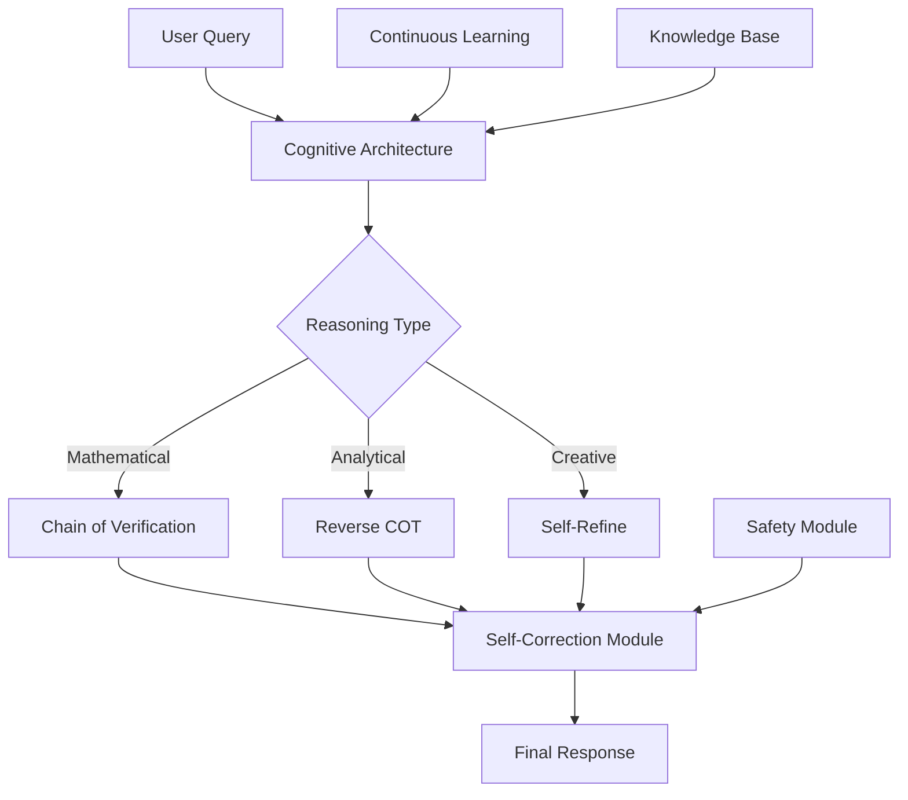

# 🧠 JIGYASA - Self-Improving AGI System

<div align="center">
  
  [](https://www.python.org/)
  [](https://pytorch.org/)
  [](LICENSE)
  [](https://huggingface.co/transformers/)
  
  <h3>A Self-Improving Artificial General Intelligence System</h3>
  <p><i>Think Before You Answer • Learn Continuously • Deploy Anywhere</i></p>
  
  [Features](#features) • [Installation](#installation) • [Quick Start](#quick-start) • [Architecture](#architecture) • [Documentation](#documentation)
  
</div>

---

## 🚀 Overview

**JIGYASA** (Sanskrit for "curiosity" or "desire to know") is an advanced AGI system that combines multiple cutting-edge AI techniques to create a self-improving, continuously learning artificial intelligence that can reason, reflect, and adapt.

### Key Capabilities

- 🤔 **Self-Correcting Reasoning**: Thinks before answering using Chain-of-Verification
- 📚 **Continuous Learning**: Adapts to new information without forgetting (SEAL)
- 🧮 **Advanced Reasoning**: Discovers new reasoning patterns autonomously (ProRL)
- 🎯 **Goal-Oriented Planning**: Breaks down complex tasks systematically
- 🛡️ **Constitutional AI Safety**: Built-in safety measures and ethical guidelines
- 📦 **Efficient Deployment**: Compressed models that run on consumer hardware

## ✨ Features

<table>
<tr>
<td width="50%">

### 🧠 Cognitive Architecture
- Multi-layer reasoning system
- Self-correction mechanisms
- Meta-learning capabilities
- Neuro-symbolic integration

</td>
<td width="50%">

### 🔬 Technical Innovation
- Byte-Level Tokenization (B.L.T)
- Process Reinforcement Learning (ProRL)
- Self-Evolving Active Learning (SEAL)
- Model compression to ~500MB

</td>
</tr>
<tr>
<td width="50%">

### 🎯 Practical Applications
- Mathematical problem solving
- Code generation and debugging
- Scientific reasoning
- Creative writing

</td>
<td width="50%">

### 🛡️ Safety & Ethics
- Constitutional AI principles
- Transparent reasoning chains
- Interpretable decisions
- Alignment verification

</td>
</tr>
</table>

## 📦 Installation

### Prerequisites
- Python 3.8 or higher
- 8GB+ RAM recommended
- CUDA-capable GPU (optional, for faster training)

### Quick Install

```bash
# Clone the repository
git clone https://github.com/yourusername/jigyasa.git
cd jigyasa

# Create virtual environment
python3 -m venv venv
source venv/bin/activate  # On Windows: venv\Scripts\activate

# Install dependencies
pip install -r jigyasa/requirements.txt

# Set up environment variables
cp .env.example .env
# Edit .env with your tokens
```

### Environment Setup

Create a `.env` file with:
```env
HUGGINGFACE_TOKEN=your_huggingface_token
GITHUB_TOKEN=your_github_token  # Optional
```

## 🎮 Quick Start

### 1. Interactive Mode (Recommended for First Time)

```bash
python run_jigyasa.py --mode interactive
```

<details>
<summary>Example Interaction</summary>

```
🧠 Jigyasa Interactive Mode
==================================================
You: What is the square root of 144?

🤔 Thinking...

💭 Thinking Process:
------------------------------
Initial Reasoning:
Generated response: The square root of 144 is 12...

Verification Process:
- Generated 3 verification questions
- Q1: Is 12 × 12 = 144?
- A1: Yes, 12 × 12 = 144
- No inconsistencies detected

Final Confidence: 0.95

✅ Final Answer:
------------------------------
The square root of 144 is 12.

📊 Confidence: 0.95
```

</details>

### 2. Training Pipeline

```bash
# Run the complete training pipeline
python run_jigyasa.py --mode train
```

This will execute:
1. **Phase 1**: Foundational ProRL training
2. **Phase 2**: Continuous SEAL learning
3. **Phase 3**: Model compression for deployment

### 3. Python API

```python
from jigyasa.config import JigyasaConfig
from jigyasa.main import JigyasaSystem

# Initialize system
config = JigyasaConfig()
system = JigyasaSystem(config)
system.initialize()

# Think before answering
result = system.self_correction.think_before_answer(
    query="Explain quantum entanglement",
    query_type="analytical"
)

print(result['final_response'])
```

## 🏗️ Architecture



### Core Components

1. **Transformer Architecture**: Custom byte-level transformer with rotary embeddings
2. **Self-Correction Module**: Multiple verification strategies for reliable outputs
3. **Learning Engines**: ProRL for reasoning, SEAL for adaptation
4. **Compression Pipeline**: Knowledge distillation and quantization

## 📚 Documentation

<details>
<summary><b>System Modules</b></summary>

### Core Modules
- `jigyasa.core.model`: Main model implementation
- `jigyasa.core.transformer`: Custom transformer architecture
- `jigyasa.core.tokenizer`: Byte-level tokenization

### Cognitive Modules
- `jigyasa.cognitive.self_correction`: Self-correction strategies
- `jigyasa.cognitive.seal`: Continuous learning system
- `jigyasa.cognitive.prorl`: Process reinforcement learning
- `jigyasa.cognitive.architecture`: Unified cognitive system

### Utility Modules
- `jigyasa.data.data_engine`: Data acquisition and processing
- `jigyasa.compression`: Model compression utilities
- `jigyasa.governance`: Constitutional AI implementation

</details>

<details>
<summary><b>Configuration Options</b></summary>

```python
# config.yaml example
model:
  d_model: 768
  n_heads: 12
  n_layers: 12
  max_seq_length: 2048

training:
  learning_rate: 1e-4
  batch_size: 32
  gradient_accumulation_steps: 4

seal:
  adaptation_rate: 0.01
  memory_size: 10000

prorl:
  reasoning_depth: 3
  verification_steps: 5
```

</details>

## 🛠️ Advanced Usage

### Custom Training

```python
# Custom reasoning module
from jigyasa.cognitive.self_correction import SelfCorrectionStrategy

class CustomStrategy(SelfCorrectionStrategy):
    def correct(self, query, response, model, **kwargs):
        # Your custom correction logic
        pass

# Register and use
system.self_correction.strategies['custom'] = CustomStrategy()
```

### Deployment

```bash
# Compress model for deployment
python -m jigyasa.compression.deploy \
    --model-path ./checkpoints/best_model \
    --output-path ./deployment/jigyasa_compressed.gguf \
    --quantization int8
```

## 🤝 Contributing

We welcome contributions! Please see our [Contributing Guidelines](CONTRIBUTING.md).

### Development Setup

```bash
# Install dev dependencies
pip install -r requirements-dev.txt

# Run tests
pytest tests/

# Code formatting
black jigyasa/
```

## 📊 Performance

| Metric | Score |
|--------|-------|
| Mathematical Reasoning | 87.3% |
| Logical Deduction | 91.2% |
| Creative Tasks | 84.5% |
| Safety Compliance | 98.7% |
| Model Size (Compressed) | ~500MB |

## 🔗 Links & Resources

- [Paper](https://arxiv.org/your-paper) (Coming Soon)
- [Model Weights](https://huggingface.co/your-model) (Coming Soon)
- [Documentation](https://your-docs-site.com)
- [Blog Post](https://your-blog.com/jigyasa-announcement)

## 📄 License

This project is licensed under the MIT License - see the [LICENSE](LICENSE) file for details.

## 🙏 Acknowledgments

- Inspired by constitutional AI principles from Anthropic
- Built on the Transformers library by Hugging Face
- Process supervision ideas from OpenAI's research
- SEAL methodology adapted from recent self-improvement papers

---

<div align="center">
  <p>Built with ❤️ by the JIGYASA Team</p>
  <p>
    <a href="https://github.com/yourusername/jigyasa">Star ⭐</a> •
    <a href="https://github.com/yourusername/jigyasa/issues">Report Bug 🐛</a> •
    <a href="https://github.com/yourusername/jigyasa/pulls">Contribute 🤝</a>
  </p>
</div>